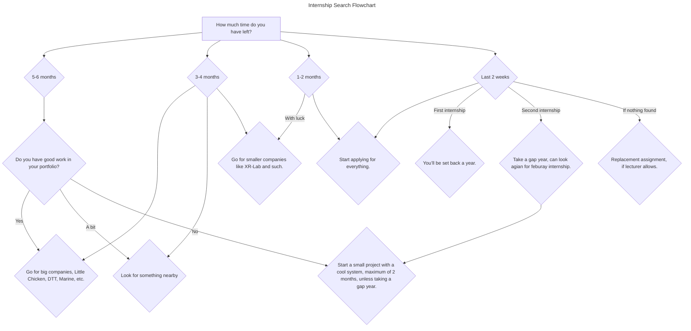

```mermaid
---
title: Internship Search Flowchart
---
graph TD;
    A[How much time do you have left?] --> B{5-6 months};

    B --> F{Do you have good work in your portfolio?}
    F --> | Yes | H{Go for big companies, Little Chicken, DTT, Marine, etc.}
    F --> | A bit | O{Look for something nearby};
    F --> | No | G{Start a small project with a cool system, maximum of 2 months, unless taking a gap year.}

    A[How much time do you have left?] --> C{3-4 months};
    C --> H;
    C --> O;
    C --> I{Go for smaller companies like XR-Lab and such.}

    A[How much time do you have left?] --> D{1-2 months};
    D --> |With luck| I;
    D --> J{Start applying for everything.};

    A[How much time do you have left?] --> E{Last 2 weeks};
    E --> J;
    E --> |First internship| K{You’ll be set back a year.};
    E --> |Second internship| L{Take a gap year, can look agian for feburay internship.};
    L --> G;
    E --> |If nothing found| P{Replacement assignment, if lecturer allows.};
```
